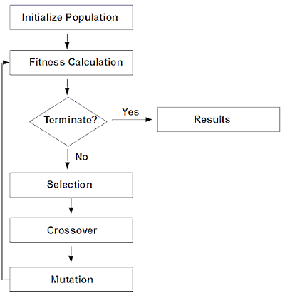
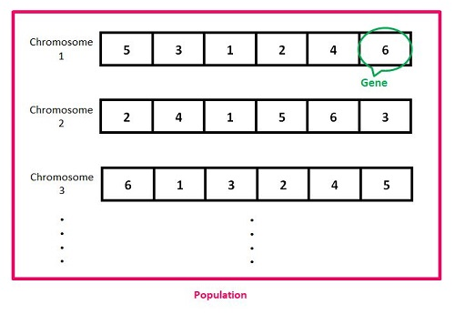
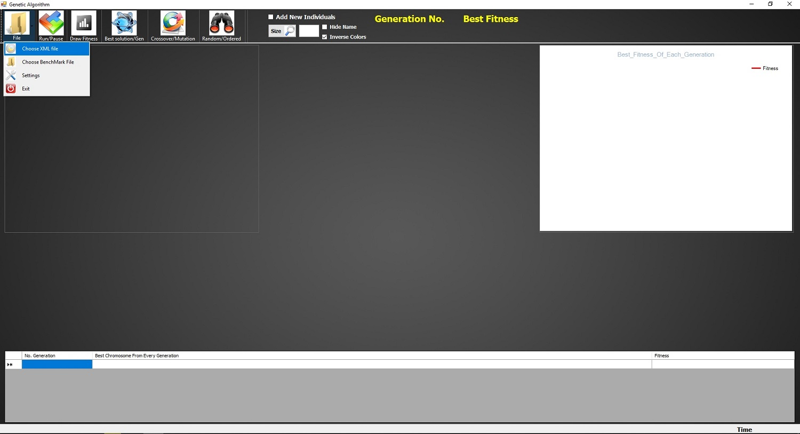
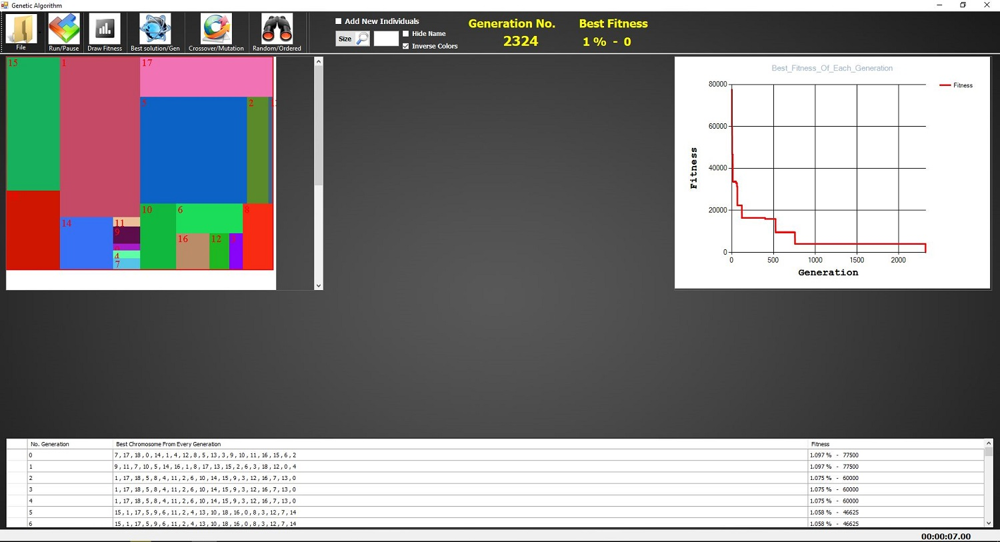
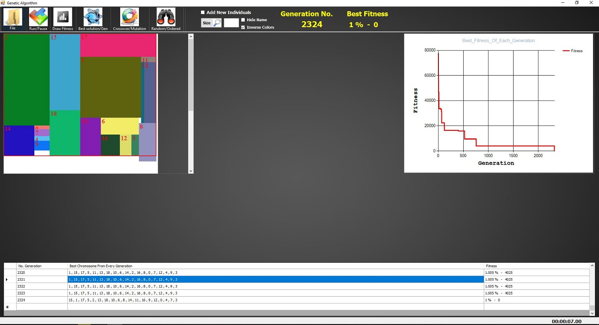
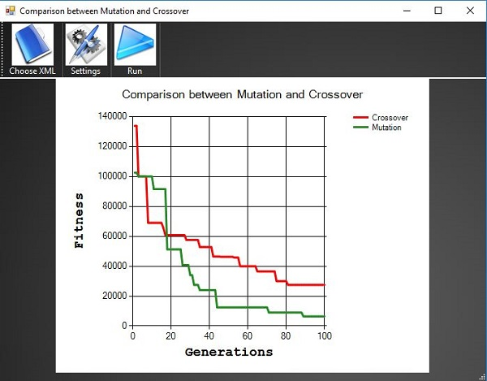
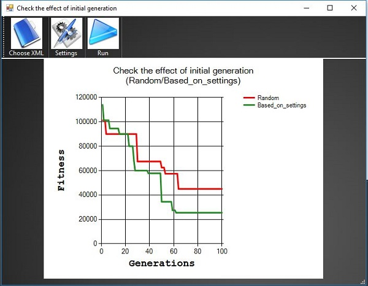

# 2D Bin Packing with Genetic Algorithm

C# project explain all steps of genetic algorithm on a simple application for 2D bin packing problem

### Installation

you should install:
- visual studio with .net 3.5
- DataVisualization (Microsoft Chart Controls for Microsoft .NET Framework 3.5) [here](https://www.microsoft.com/en-us/download/details.aspx?id=14422)

### Genetic Algorithm Pipeline

### Population representation for this problem

Each order of bins/numbers in each chromosome represent one solution/packing for those 2d-bins
each number in a chromosome represent 2D-Bin/Rectangle.
the optimal solution/chromosome will have the correct order where the cost of fitness function will be minimal ('0' for no wasted space)

### Main Form

when you run the project -> File -> choose xml file -> choose one of the examples that you want to pack (you can even draw your own ones - just keep same structure for the xml file)

you can watch the draw of the best solution/order/chromosome in each population from the GridView by clicking over the order you want:

### comparison between the effect of mutation and crossover 

this will show if running only mutation will find the best chromosome faster than running only crossover and vice versa.
this is only a comparison between the **implemented** mutation & crossover for this problem.

### comparison between random initial Generation against initial generation with 'tall/small/big/...' bins first

this will show you that ordering the 2d-bins even simply is much better than keeping them totally random in the initial/first Generation.
ordering here means create a chromosome that will have tall bins first, and another chromosome will have small bins first ...

### important note:
the reason of why .net 3.5 is because this is an old project that I wrote in 2012. I am sharing it now it might help someone to understand the different steps of genetic algorithm on this specific application.
